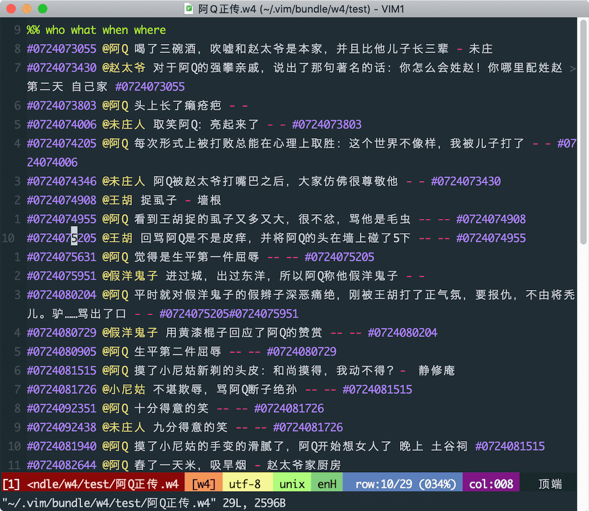
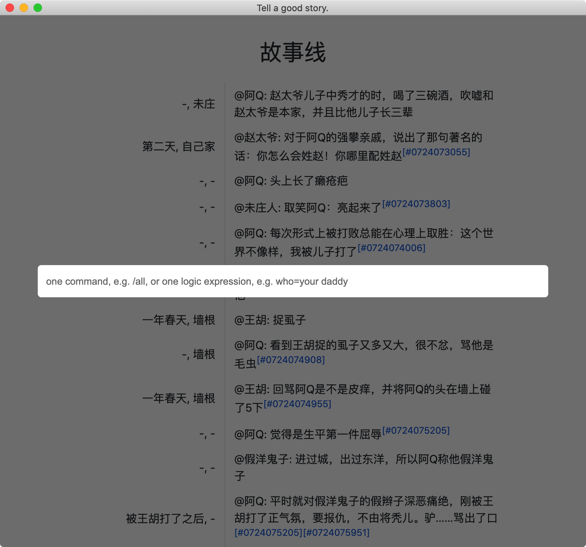
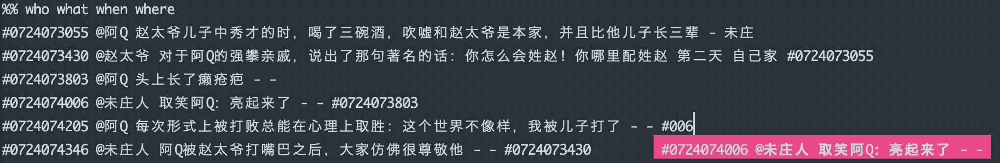
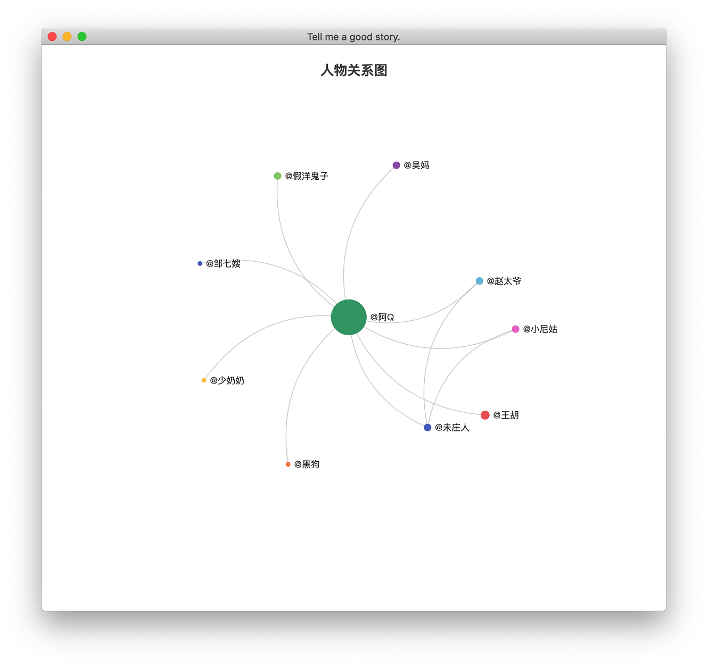
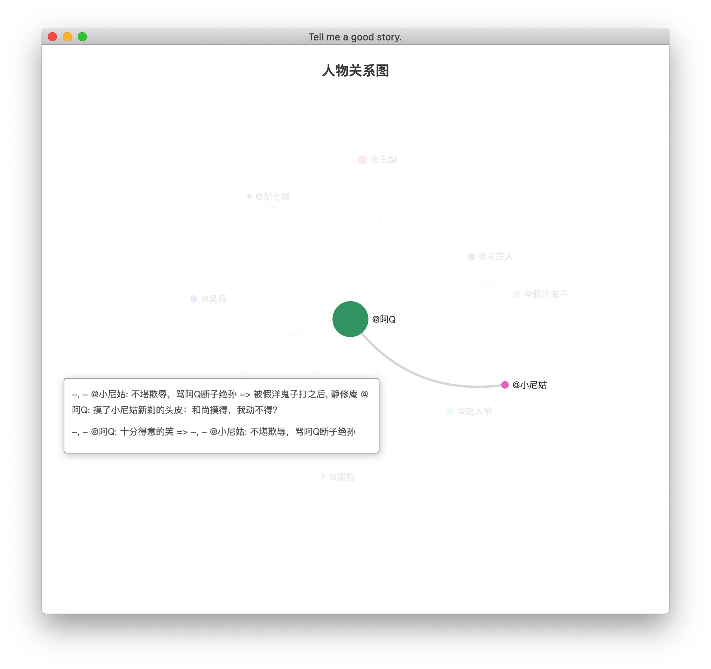
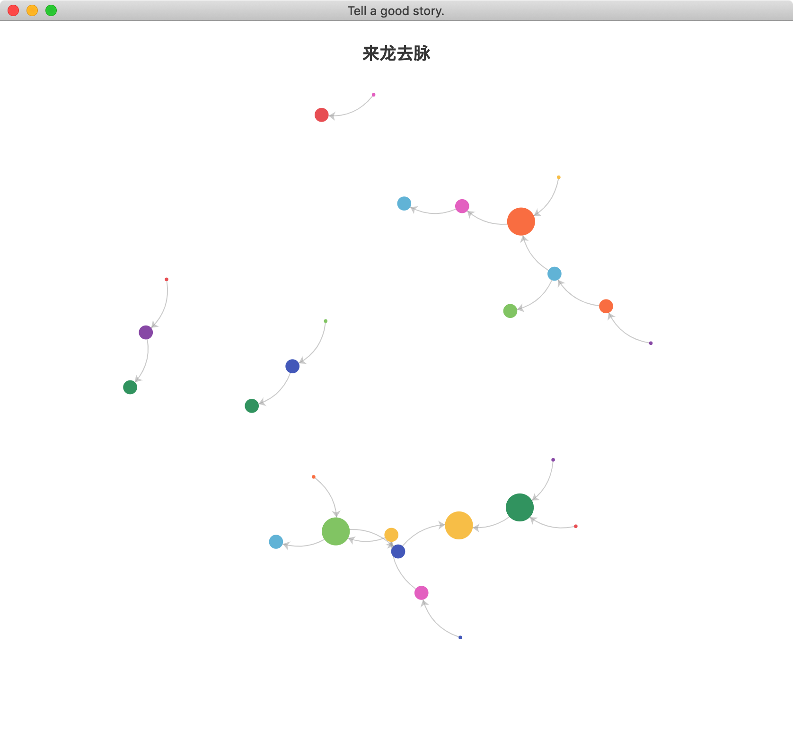
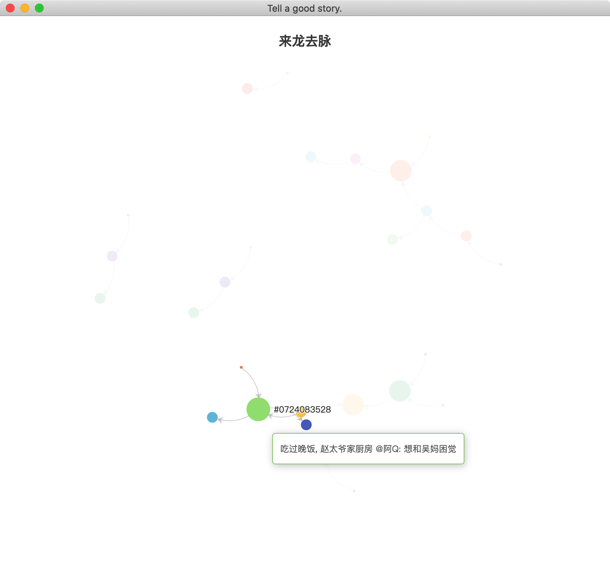

# w4
不知道大家有没有这样的需求，看小说有时候想理一下时间（故事）线，更好的理解剧情发展。之前用过思维导图整理，但是总觉得思维导图“有点重”，在作图的过程中，会陷入“到底是选择方框还是圆框”、“到底是虚线还是实线”这样的纠结中，导致最后做出来的图形式大于内容，搞得自己很疲惫。也曾在本子上整理，但是不便于检索和保存。其实想要的很简单：可以大致下查看事件发生的先后顺序和联系，具有一定的筛查功能就够了。

在这样的背景下，有了这款vim插件，之所以选择vim是因为自己平常用的较多，写博客、纯文本编辑一般都用它。插件名字w4，灵感来源小说三要素：地点、人物、事件，翻译成英文就是where、who、what，再加一个时间when。


大概支持以下功能：
- 纯文本
- 自动补全
- 设置关联
- 类SQL筛查 
- 人物关系图
- 事件关系图

## 使用方式
安装完成后，设置浏览器路径
```
" 可以这样设置Chrome路径
let g:w4_chrome_path = ""

" 设置Firefox浏览器路径
let g:w4_firefox_path = ""
```

在vim输入`:W4Go`命令打开浏览窗口，按`enter`打开输入窗口，效果是模仿游戏聊天窗口的样子，效果如下，


## 文本样式
文本以`%% who what when where`开头，如下所示：
```
%% who what when where
#0724073055 @阿Q 赵太爷儿子中秀才的时，喝了三碗酒，吹嘘和赵太爷是本家，并且比他儿子长三辈 - 未庄
#0724073430 @赵太爷 对于阿Q的强攀亲戚，说出了那句著名的话：你怎么会姓赵！你哪里配姓赵 第二天 自己家 #0724073055
#0724073803 @阿Q 头上长了癞疮疤 - -
#0724074006 @未庄人 取笑阿Q：亮起来了 - - #0724073803
#0724074205 @阿Q 每次形式上被打败总能在心理上取胜：这个世界不像样，我被儿子打了 - - #0724074006
```
分别代表人物、事件、时间、地点，人名以@开头。可以看成一个4列的数据库表，列以空格分割，如果不愿意用空格也可以在文件头自己指定。例如可以在文件头加上下面的指令指定以斜杠（`/`）为分隔符，
```
%% col_split_char=/
```
列的顺序可以调整，比如想按时间、地点、人物、事件的顺序，可以这样指定，
```
%% when where who what
```
如果当前列为空用`-`代替，在实际使用中我发现经常要表示"同上"、"同上上"的语义，"同上"使用`--`，"同上上"使用`---`。例如下面的文本，
```
%% who what when where
……
#0724074908 @王胡 捉虱子 一年春天 墙根
#0724074955 @阿Q 看到王胡捉的虱子又多又大，很不忿，骂他是毛虫 - -- #0724074908
#0724075205 @王胡 回骂阿Q是不是皮痒，并将阿Q的头在墙上碰了5下 --- -- #0724074955
……
```
最终生成的内容是：
```
%% who what when where
……
#0724074908 @王胡 捉虱子 一年春天 墙根
#0724074955 @阿Q 看到王胡捉的虱子又多又大，很不忿，骂他是毛虫 - 墙根 #0724074908
#0724075205 @王胡 回骂阿Q是不是皮痒，并将阿Q的头在墙上碰了5下 一年春天 墙根 #0724074955
……
```
需要注意的是第三行在时间这列使用了"同上上"，这样这列的内容真正"同"的是第一行的"一年春天"，如果这里使用"同上"，"同"的就是第二行中的`-`了，"同上上"会持续往上找，直到找到当前列"非空"的行。


可以看到，示例文本是多于四列的，因为第一列相当于id，唯一标识一行，最后一列是关联列，用于建立各行之间的联系。

## 自动补全
输入@符号自动提示所有的人名

输入#提示之前的条目，在输入过程中可以使用Tab触发补全，可以只输入少量字符按Tab自动补全，比如示例文本最后一行可以输入#006就会自动提示。


## 类SQL筛查
支持：
- 特殊命令：以`/`开头，目前有三个，`/all`显示所有的条目，`/characters`显示人物关系图，`/events`显示事件关系图
- 逻辑表达式：与（&）、或（|）、非（!）、等于（=，模糊匹配）、不等于（!=）

比如和阿Q相关的事：
```
who=阿Q
```
人物或事件包含小尼姑：
```
who=小尼姑 | what=小尼姑
```
未庄发生的事：
```
where=未庄
```
春天发生的事：
```
when=春天
```

## 人物关系图
输入`/characters`命令




## 事件关系图
输入`/events`命令





