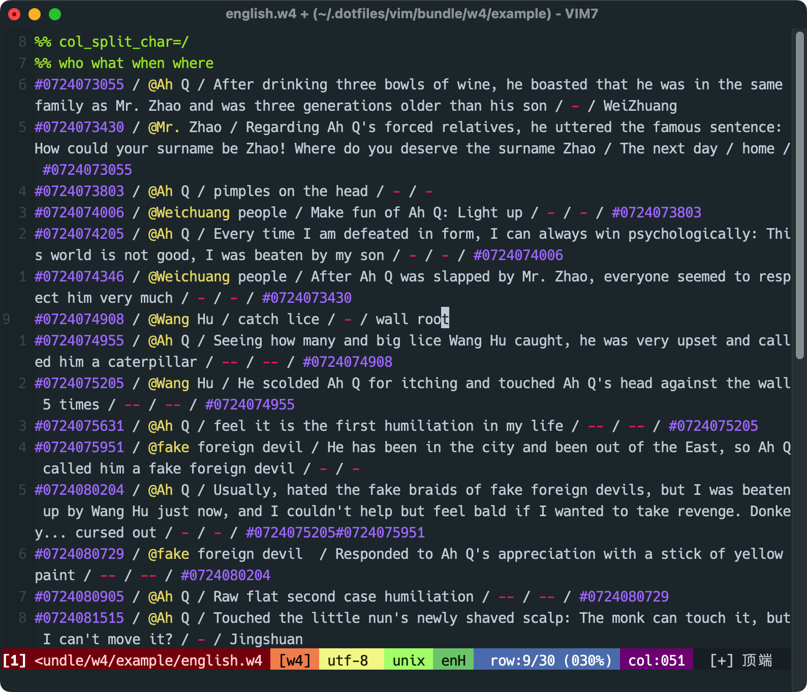
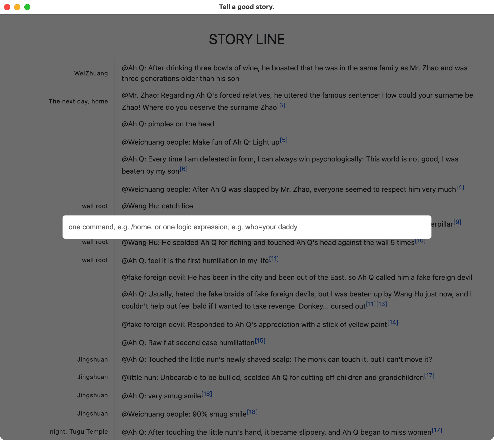
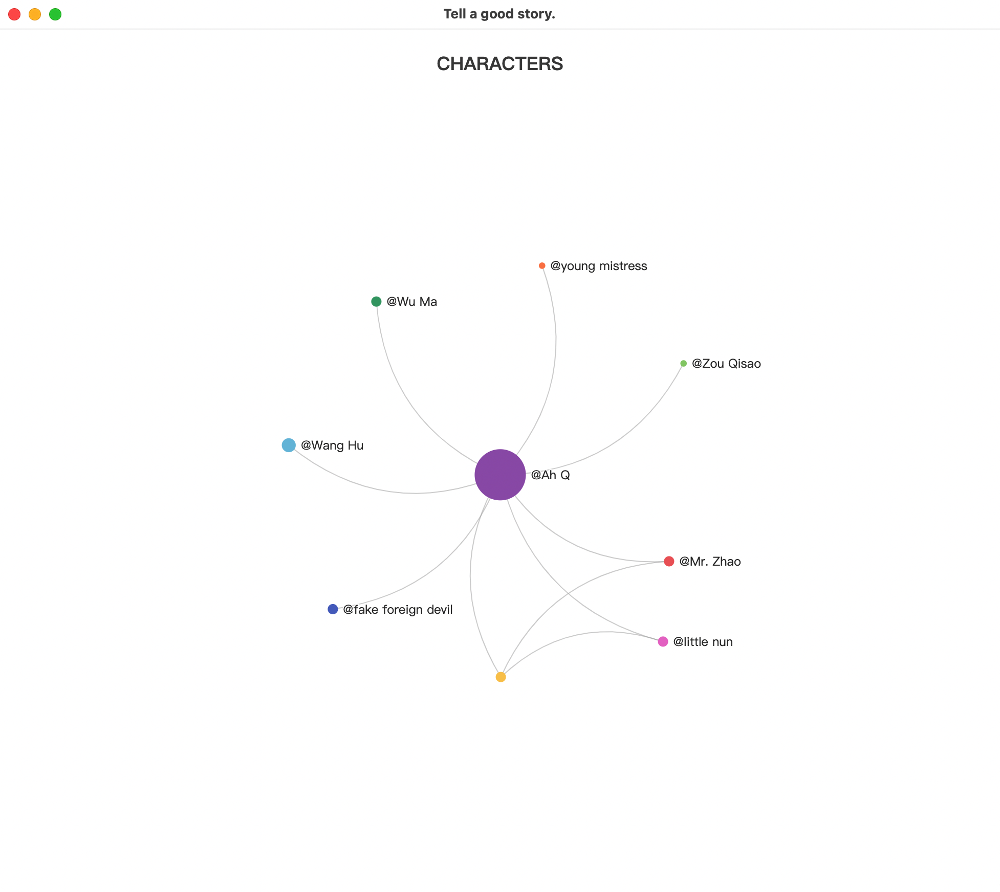
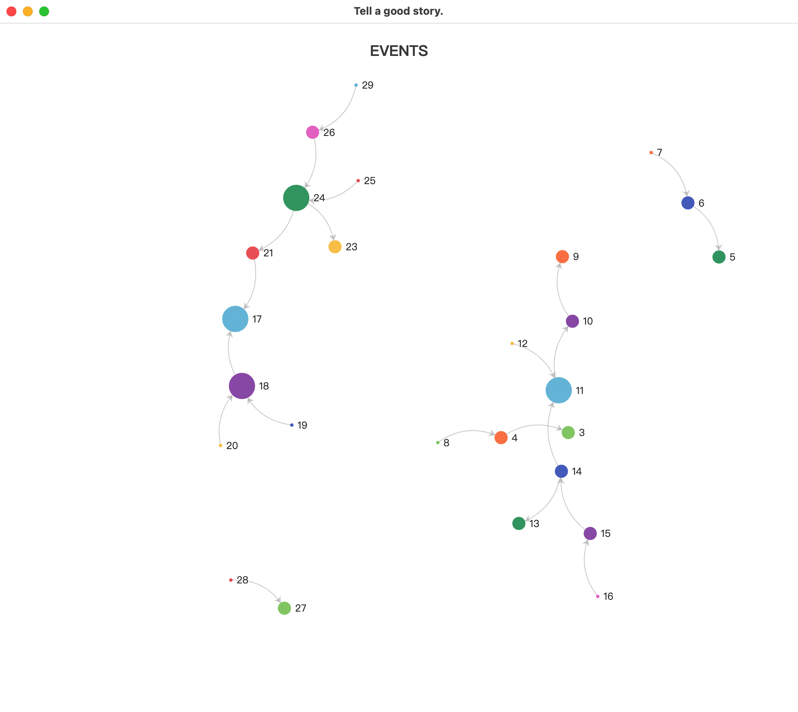

[](./README.md)
[](./README_CN.md)

[中文文档](./README_CN.md)

# w4

https://user-images.githubusercontent.com/2225426/211180538-abb57cdd-8f0e-4d8f-8880-74b625889b9d.mp4

I don’t know if you have such a need, when reading novels, sometimes I want to sort out the time (story) line to better understand the development of the plot. I have used mind maps to sort out before, but I always feel that mind maps are "a bit heavy". In the process of drawing, I will fall into the entanglement of "whether to choose a square box or a round box", "whether it is a dashed line or a solid line", finally, **form is greater than content**, which makes me very tired. I've also organized it in a notebook before, but it was not easy to retrieve and save. In fact, what I want is very simple: I can view the development sequence of the story and the connection between events, with a simple retrieve function.

In this context, I wrote this vim plugin, I chose vim because I use it a lot daily, such as blogging and plain text editing. The name of the plug-in is w4, inspired by the three elements of the novel: where, who, what, plus a when.



Feature:

- Plain text
- Reference(connections between events)
- Query expression
- Characters diagram
- Event diagram

## Settings

You need to set the browser installation path to make the plugin work, the plugin supports Chrome and Firefox, you can choose either.

```
" set chrome path
let g:w4_chrome_path = ""

" set firefox path
let g:w4_firefox_path = ""
```

Enter the `:W4Go` command in vim to open the browsing window, press `enter` to open the input window, the effect is to imitate the appearance of the game chat window, the effect is as follows,



## w4 file format

The text starts with `%% who what when where` and looks like this:

```
%% col_split_char=/
%% who what when where
#0724073055 / @Ah Q / After drinking three bowls of wine, he boasted that he was in the same family as Mr. Zhao and was three generations older than his son / - / WeiZhuang
#0724073430 / @Mr. Zhao / Regarding Ah Q's forced relatives, he uttered the famous sentence: How could your surname be Zhao! Where do you deserve the surname Zhao / The next day / home / #0724073055
#0724073803 / @Ah Q / pimples on the head / - / -
#0724074006 / @Weichuang people / Make fun of Ah Q: Light up / - / - / #0724073803
```

They represent people, events, time, and places respectively, and the names start with @. It can be regarded as a 4-column database table, and the columns are separated by `/`. You can specify separator yourself in the file header. For example, you can add the following command to the file header to specify a slash (`/`) as the separator,

```
%% col_split_char=/
```

If the current column is empty, replace it with `-`. In actual use, I often find that the semantics of "same as above" and "same as above" are often expressed. "Same as above" uses `--`, and "same as above above" uses `---` .

It can be seen that the sample text has more than four columns, because the first column is equivalent to id, which uniquely identifies a row, and the last column is an associated column, which is used to establish the connection between rows, see complete file in `/example/english.w4`.

## Autocomplete

- Enter the `@` symbol to automatically prompt all names
- Enter the `#` symbol to automatically prompt all rows
- Use `Tab` to trigger completion during the input process


## Query expression

support:
- Special commands: start with `/`, there are currently three, `/home` displays all entries, `/characters` displays the character relationship diagram, `/events` displays the event relationship diagram.
- Logical expressions: and (&), or (|), not (!), equal to (=, fuzzy match), not equal to (!=)

For example, something related to Ah Q:

```
who=Ah Q
```

People or events include Little Nun:

```
who=little nun | what=little nun
```

What happened in WeiZhuang:

```
where=WeiZhuang
```

What happened in spring:

```
when=spring
```

## Characters diagram

input `/characters`



## Events diagram

input `/events`


